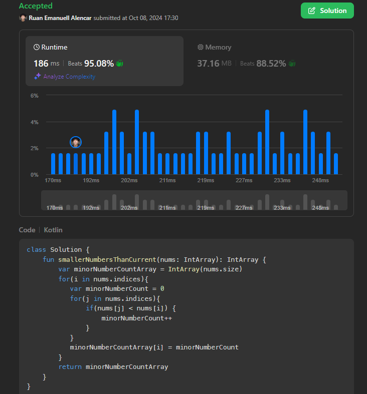

## LeetCode-Exercises
    
### What is this? 🤔 
The exercises i'm doing on LeetCode to improve my skills on problem solving and in the programming languages I want to evolve.
Every folder inside the contains an exercise with the problem description and my stats on that problem, as well as my solution.
Hope you enjoy!
    
### Which technologies were used to solve problems as of now? 🚀 
<table><tr><td style="padding: 5px;">
        

            
            
Kotlin

        

    </td><td style="padding: 5px;">
        

            
            
Javascript

        

    </td><td style="padding: 5px;">
        

            
            
Python

        

    </td></tr></table>
		
### Example of an solution: ⚡️
